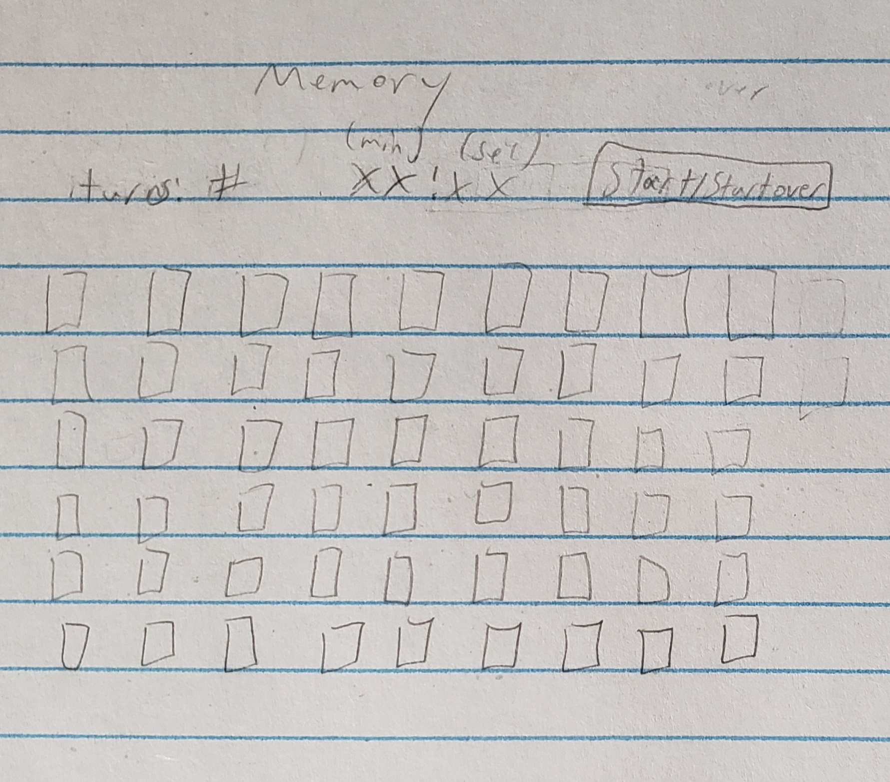

# Concentration

| Table of Contents |
| ----------------- |
| [About](#about) |
| [Design](#design) | 
| [Ports](#ports) |
| [Goals](#goals) |

## About

This project is a re-creation of the card game [concentration](https://en.wikipedia.org/wiki/Concentration_(card_game)). The goal of the game is to match up each card with another that has the same rank. This is done by choosing two face-down cards and flipping them to see if they match, staying face-up if they do. This must be done in as few turns as possible.

## Design

The initial design is quite simplistic, only using a turn counter, timer, and start button, along with 54 cards:

The current design is similar, with the main difference being the addition of two more cards (2 jokers) and the timer using only seconds:

The project uses google's [material design](https://m3.material.io/), more specifically [material web components](https://github.com/material-components/material-components-web), which works for most web frameworks.

## Ports

### Elm

### Vue

## Goals